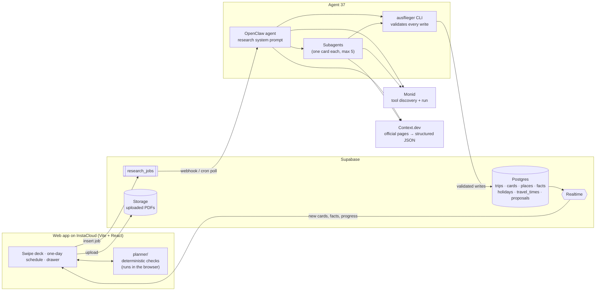

<p align="center">
  <picture>
    <source media="(prefers-color-scheme: dark)" srcset="brand/logo-dark.svg">
    
  </picture>
</p>

<p align="center"><b>A trip planner with an agent that checks whether your schedule actually works, and tells you why when it doesn't.</b></p>

<p align="center">
  <a href="https://prod-main-web-c3f29b-00kqxs6r2dz.compute.instacloud-edge.com">Live demo</a> ·
  Video (coming soon) ·
  <a href="#how-it-works">Architecture</a>
</p>

Agent Hackathon, 07.10.2026. Mobile-first, English only. Open the live demo on a phone or in your browser's mobile view.

---

## What it does

You describe a trip (destination, dates, arrival and departure, a booking PDF, a few preferences). A research agent finds sights, museums, restaurants, bars and events for those dates. You swipe through the suggestions, and the accepted ones become **cards** in a one-day-at-a-time schedule.

**The conflict manager is the core.** Every slot is checked against:

- opening hours for that exact date, including midday breaks and **last entry**
- **fixed appointments**: trains, show times, reservations
- **walking-time ranges** between places (the check uses the upper bound plus a buffer)
- **public holidays** (national, regional, city). A holiday triggers a check for that venue's special hours. It never implies the venue is closed.
- meal-time preferences and booking time windows

When a slot doesn't work, the app says why: *"Visit ends at 18:40, after Residenz München closes at 18:00."* When a fact is unknown, unconfirmed or contradicted by another source, the card is marked **needs checking**. It is never shown as definitely possible or definitely impossible.

## How it works

1. **Trip and preferences.** City, dates, arrival and departure, uploads (booking times extracted from a PDF stay unconfirmed until you confirm them), meal times, interests, pace and visit style (short / normal / long, which sets default visit durations).
2. **Swipe.** Suggestions stream into a Tinder-style deck while the agent keeps researching. Right = want, left = skip.
3. **Schedule.** Accepted cards get planning-critical research and are placed into days. Drag & drop to reorder. Every drop target shows its severity *before* you drop, and times are recalculated in the browser. A bottom drawer holds unscheduled and alternative cards. **Search again** ("more indoor activities", "something near the hotel tomorrow afternoon") adds new suggestions without touching the current plan.



- The **agent supplies facts with evidence**. The **planner decides feasibility**. The planner is pure TypeScript, has no I/O and runs on the client, so reordering is instant and needs no API calls.
- The prepared demo and the live agent use the same card schema (`shared/types.ts`) and the same planner.
- Agent internals, triggering and CLI rules: [agent/README.md](agent/README.md).

## Sponsors & tools used

| Tool | What it does in Ausflieger |
|---|---|
| **[Agent 37](https://agent37.com)** | Hosts the research agent (`agent37-openclaw` template). The same OpenClaw instance also deployed the web app to InstaCloud. |
| **OpenClaw** | Agent runtime. The research system prompt (`agent/workspace/AGENTS.md`), a research skill, **subagents** (`sessions_spawn`) that research accepted cards in parallel, and browser automation as a last resort for pages that need clicks. |
| **[Monid](https://monid.ai)** | Tool discovery (`discover` → `inspect` → `run`) for everything except official-page reading: places and coordinates, Google Maps hours as a second source, web and event search, holiday APIs, PDF parsing, trains and flights. Working provider/endpoint pairs are remembered. |
| **Context.dev** | Preferred way to read official venue, hotel, tourism-board and event-calendar pages, including JS-heavy ones. JSON-schema extraction turns them into opening hours, last entry, breakfast times and similar structured facts. |
| **[Supabase](https://supabase.com)** | Postgres schema (trips, cards, places, fact-level evidence, holidays, travel matrix, research jobs, change proposals, agent events), a `fact_status` view that derives `conflicting`, **Realtime** to stream cards and progress into the app, **Storage** for uploads, an Edge Function (`trigger-agent`) that wakes the agent when a job is inserted, and the researched Munich demo seed. |
| **[InstaCloud](https://www.instacloud.com)** | Hosts the web app (root `Dockerfile`, small Node server with `/api/health` and runtime Supabase config). Deployed by the OpenClaw agent following [deploy/OPENCLAW_DEPLOY.md](deploy/OPENCLAW_DEPLOY.md). |

## Research rules

The research system prompt gets most of the tuning effort. Full text: [agent/workspace/AGENTS.md](agent/workspace/AGENTS.md).

- **Planning impact first.** Fixed times, date-specific hours, closures and last entry come first. Location, duration, reservation and price come next, descriptions last. Each tier is written as soon as it is done, and every step has a tool-call budget, so usable cards arrive early.
- **Authoritative, date-specific sources.** The operator's page for the trip date beats generic listings.
- **Two sources for critical facts** (usually the official page plus Google Maps or the city portal) where available, not for every fact. Source count alone doesn't establish confidence: authority, freshness and date applicability are recorded too.
- **Disagreement is kept, not resolved.** Both claims are stored as separate facts, and the database derives `conflicting`.
- **Holidays are always checked** at national, regional and city level. A holiday triggers a check for special hours. It does **not** imply closure: only documented exceptions override regular hours. If holiday hours can't be confirmed, they are marked needs checking.
- **Event calendars** (city tourism, venues, event planners) are scraped for the trip dates. Seasonal hours and special closures are also checked.
- **Never invent values.** Every sourced fact stores its URL, retrieval time and applicable dates. Estimates carry their basis.
- **Evidence levels per fact:** `operator_confirmed` (for the trip date) · `regular_hours` · `estimated` · `unknown` · `conflicting` (derived).
- **Write rules enforced by the CLI:** the agent cannot set day, position or swipe status, and cannot confirm bookings. On a scheduled card, changes to duration, times or place become **proposals** that the user accepts or rejects. The agent never silently moves a card. Sourced facts need a URL, `operator_confirmed` needs an operator source, and no reference may cross trips.

## Planning rules

Implemented in [planner/](planner/README.md).

- **Hard constraints** (blockers): confirmed bookings, fixed event times, documented closures, opening windows. A visit must fit **entirely** inside an opening interval and start no later than last entry.
- **Preferences** (warnings): meal times, booking windows marked as preference. Deviations are explained but don't block.
- **Assumptions**: visit durations (from visit style or sourced information) and walking-time ranges. They are labelled and editable, and they are used conservatively: the travel gap is the range's upper bound plus a 15-minute buffer. A missing pair falls back to 30 minutes and is flagged.
- **Needs checking**: unknown hours, unconfirmed holiday hours, conflicting sources, unconfirmed bookings. A slot without a known conflict is not automatically "verified". Provisional cards can stay with a visible warning.
- Fixed cards are locked. Flexible cards wait for their window or the next opening interval (for example after a midday break). Dropping a card also reports what it breaks *later* in the day, such as a train that becomes unreachable.

## Demo: Munich during Oktoberfest 2027

**Sat 2 – Sun 3 Oct 2027**, the last weekend of the Wiesn. Sun 3 Oct is German Unity Day *and* the last Wiesn day. The data was researched on 2026-10-07 from official sites and the city portal: 108 facts, each with a source or an estimation basis. Details and sources: [data/README.md](data/README.md).

| Sat 2 Oct | Sun 3 Oct (holiday) |
|---|---|
| 09:16 ICE arrival (fixed) | 07:30 Breakfast at Hotel Uhland (07:30–10:00 window) |
| Drop luggage at Hotel Uhland | Check out (from PDF, unconfirmed) |
| 11:00 Glockenspiel (fixed show time) | 09:00 Oktoberfest, last day |
| Frauenkirche & south tower | 12:00 Böllerschießen at the Bavaria (fixed, two sources) |
| Lunch at Weisses Bräuhaus | Lunch in a Wiesn tent |
| Viktualienmarkt (sources disagree → needs checking) | Alte Pinakothek (open until 18:00 on 3 Oct per muenchen.de) |
| Residenz München (last entry 17:00) | 18:32 ICE departure (fixed) |
| Check in (from PDF, unconfirmed) · Dinner at Augustiner-Keller | |

The prepared plan has **no blockers**. Its needs-checking items are intended: unconfirmed hotel booking times, undocumented luggage storage and conflicting market hours. The drawer holds the Deutsches Museum, Schumann's and the Englischer Garten. "Search again" streams more suggestions into the deck.

**Showcase conflicts** (each one is asserted against the real planner in `data/scripts/plan-check.mjs`):

| Move | The app says |
|---|---|
| Residenz after the hotel check-in | "Visit ends at 18:40, after Residenz München closes at 18:00" |
| Deutsches Museum from the drawer after the Residenz | "Visit starts at 17:57, after Deutsches Museum closes at 17:00" |
| Frauenkirche before the Glockenspiel | "Ends at 11:34; can't reach Glockenspiel at Marienplatz at 11:00 in time" |
| Viktualienmarkt onto Sun 3 Oct | Closed: market stalls closing on 3 Oct 2027 is **documented** by the city, so this is a real closure and not an assumption |
| Deutsches Museum onto Sun 3 Oct | "Opening hours on 3 Oct (German Unity Day) are not confirmed" → needs checking, not closed |

The last two moves show the holiday rule: a closure is shown only when it is documented, and otherwise the hours are marked unconfirmed.

## Repository layout

| Path | Contents |
|---|---|
| [`web/`](web/README.md) | Vite + React + TypeScript app: landing, preferences, swipe deck, schedule with drag & drop (@dnd-kit), drawer, proposals. `TripStore` with an offline `LocalStore` and a Supabase store. `server.mjs` serves the build on InstaCloud. |
| [`planner/`](planner/README.md) | Deterministic schedule checks: `scheduleDay`, `checkPlacement`, opening hours, holidays, travel gaps. No dependencies, 62 tests. |
| [`shared/types.ts`](shared/types.ts) | Single card, place, fact and job schema used by the web app, planner, agent CLI and demo data. |
| [`agent/`](agent/README.md) | OpenClaw workspace (`AGENTS.md` research prompt, `ausflieger-research` skill, heartbeat), the validating `ausflieger` CLI (`tools/`, zod + supabase-js) and `install.sh`. |
| [`supabase/`](supabase/) | Migration (schema, RLS, `fact_status` view, `clone_trip` RPC, Realtime, storage bucket), generated `seed.sql`, one-shot `setup.sql`, `trigger-agent` Edge Function. |
| [`data/`](data/README.md) | Researched Munich dataset: generator script (source of truth), `demo/munich.json`, demo hotel PDF, plan and DB verification scripts. |
| [`deploy/`](deploy/) | Step-by-step instructions the OpenClaw agent follows to deploy to InstaCloud and connect Supabase. |
| `brand/` | Logo (light, dark, mark). |
| `video/` | Submission video sources (Remotion). |
| `Dockerfile` | Builds `web/` (with `planner/` and `shared/`) for InstaCloud. |

## Run locally

Node 20+.

```sh
# Web app, offline demo mode (no keys needed): real researched Munich data, simulated agent
cd web && npm install && npm run dev        # http://localhost:5173, then "Open the Munich demo" or /?demo=munich

# Planner tests (62)
cd planner && npm install && npm test

# Agent CLI tests: schema validation, walking estimates, integration against the real migration in PGlite
cd agent/tools && npm install && npm test

# Schema test: runs the Supabase migration in PGlite (from the repo root)
npm install && npm run test:schema

# Demo data: rebuild and verify (typecheck, plan-check, seed in PGlite)
cd data && npm install && npm run build && npm run check
```

In offline mode, everything runs in the browser with the prepared bundle. A simulated agent streams cards, "researches" accepted cards, parses an upload into unconfirmed booking cards and proposes one change. To use Supabase, set `VITE_SUPABASE_URL` / `VITE_SUPABASE_ANON_KEY` (see [web/README.md](web/README.md)).

## Deploy

- **Supabase:** run `supabase/setup.sql` (schema + Munich seed) in the SQL editor, or use `supabase/migrations/` + `seed.sql`.
- **Web app on InstaCloud:** [deploy/OPENCLAW_DEPLOY.md](deploy/OPENCLAW_DEPLOY.md). Only the anon key goes to the web app.
- **Agent on Agent 37 + Supabase wiring:** [deploy/OPENCLAW_SUPABASE.md](deploy/OPENCLAW_SUPABASE.md) and [agent/README.md](agent/README.md) (install, `.env` with the service role key on the instance only, webhook or cron triggering).

## Status & limitations

**Working and verified**
- Web app live on InstaCloud, deployed by the OpenClaw agent on Agent 37.
- Supabase project with the schema and the researched Munich seed.
- Offline demo with real researched data: swipe, schedule, drag & drop with conflict explanations, drawer, Search again, proposals.
- Planner (62 tests), agent CLI test suite (including integration against the real migration), schema test, demo plan and seed verification.

**Implemented or designed, but not proven end to end live**
- Live research jobs triggered from the app (app → `research_jobs` → agent → CLI → Realtime). Every piece exists: the Supabase store, the Edge Function, the cron fallback, the CLI and the research prompt. The full loop from the deployed app has not been demonstrated yet, and open questions about Agent 37 / OpenClaw triggering are listed in [agent/README.md](agent/README.md#open-questions-agent-37--openclaw).
- Live PDF parsing through Monid. In offline mode, PDF parsing is simulated.

**Known limitations**
- 2027 train times and some 2027 holiday hours are not published yet. They are marked `estimated` or `unknown` rather than guessed.
- Travel times are walking estimates (haversine × 1.3 detour, 4.5–5 km/h), not routing.
- No authentication. Demo trips are cloned per visitor through `clone_trip`. RLS keeps the seeded demo trip read-only; other trips are open to anyone who knows their id.
- One city (Munich), two days.

## Out of scope (for now)

- Showing tool-call cost in the frontend
- Pinch-to-resize and drag-to-resize buffers (buffers are editable in minutes)
- Comprehensive restaurant-guide, magazine, blog and influencer research
- Exact public transport routing and multiple transport modes
- More demo cities and longer trips
